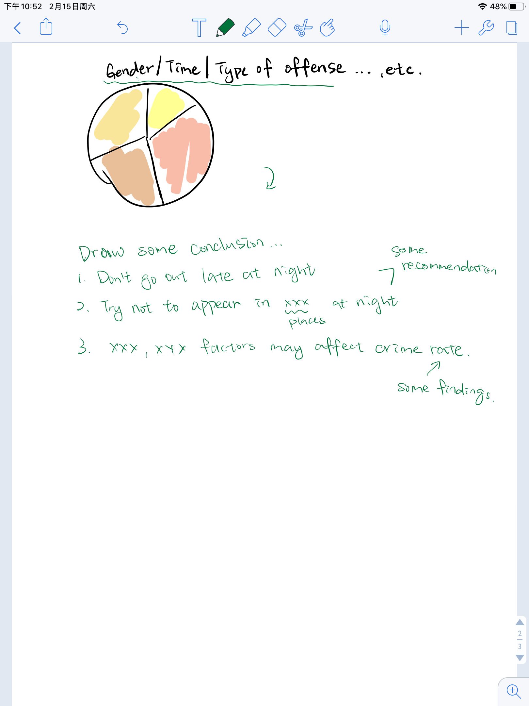
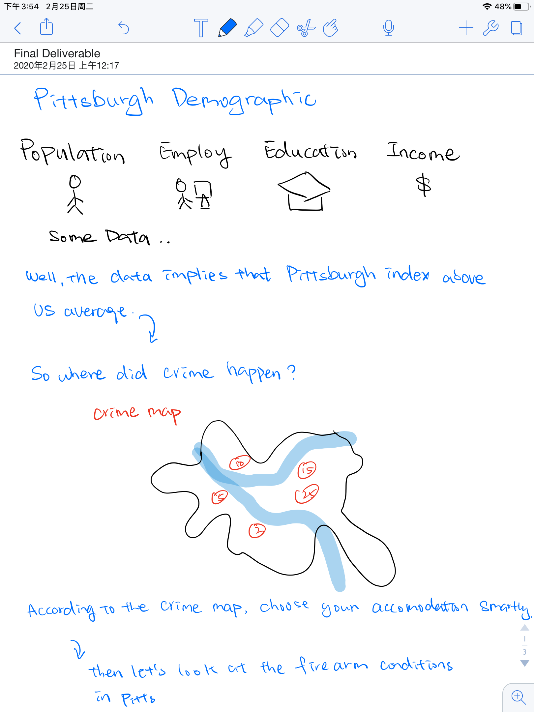
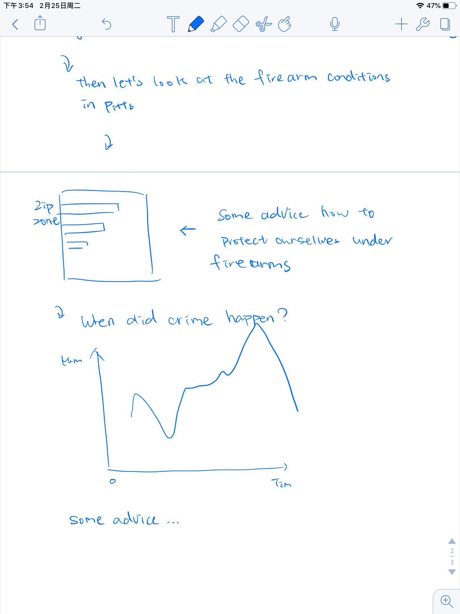

# The Idea

## Summary & Outline

This final project is going to focus on the topic of crime rate of Pittsburgh and discussing factors like: The time, weapon type, crime zone, etc. By collaborating those factors, provide the audience some suggestions on how to stay safe in Pittsburgh.

## Core Elements of Story

First, there is going to be an overview of the demographic of Pittsburgh, showing some index facts that may affect crime rate. Then, there will be a map showing some major zones of crime accidents. Then there might be a line chart analyzing the trend of crime rate. After that, I may use pie chart to analyze the some core parameters like Type of Offense, Age, Gender, Date, Season, Time, Incident Zip that may affect crime willingness and draw a conclusion.

## Data Source

I will get data from two sources below:

[Pittsburgh Arrest Data] (https://data.wprdc.org/dataset/arrest-data)

[Pittsburgh Firearm Seizure] (https://data.wprdc.org/dataset/pbp-fire-arm-seizures)

I plan to analyze available Pittsburgh arrest data for 2016-2019, and weapon ownership data in order to discover trends, identify association between factors, discover clusters or segments and provide the audience with relevant recommendations.

## Method and medium

My current plan is to use Shorthand for the final project presentation. And I also plan to use Tableau for the visualization part to further analyze the crime factors. If needed, I may use some coding language to clean the data and do some extreme value correction first, and then import the cleaned data to the platform mentioned above for further analysis.

# Design and User Research

##  Sketches and Storyboard 

Below are the original sketches:

## User Research Protocol and Findings

As my target audience is CMU student who lives in Pittsburgh. So I select three CMU friends from different living area in Pittsburgh to give me my original story’s feedback.

### Interview Questions

I asked them questions like:
1. Do you think it is a fluent presentation? 
2. Is it logical? 
3. From the content perspective, what do you think needed to be added or deleted? 

### Suggestions
My friends think there are three places I need to change:
1. There are some factors do not need to be mentioned like defense type. Cause when a student met a criminal, all he/she should do is run, hide and call the police
2. I should use histogram and line chart that would fit better for the data 
3. I should be add some transition between each visualization and provide according advice for each part

## Revised Wireframes

# Final Data Story

## Target Audience

My call for this topic is because when I am choosing the area I want to live in Pittsburgh, safety is one of the major factors that I would focus on. As we are turning to the end of this academic year, so I believe a lot of students in CMU may choose to switch their accommodation to somewhere else.

So my target audience is CMU students living in Pittsburgh. I believe they would be interested in the fun facts of crime happened in their community and I hope to provide them some suggestions that would help them when choosing future accommodation.

## Design Process

At the beginning, when I first come up with this idea, I just draw a story board telling my friends the whole story I want to present. They give me many useful ideas that help me narrow down and make my logic more fluent and clear. 
Based on the crime data and firearms data of Pittsburgh from 2016-2019, I hope to help give some useful suggestions for accommodation choosing, like which area is more dangerous and which area is better. Then I consider this content would be a little light, so I also tried to figure out the correlation between crime incidents and firearms. The analysis indicates that they are highly related, so I also provide some suggestions on what should people do under firearm conditions.

After the wireframe is revised, I start to do the visualization part. To complete that visualization part, I decide to employ map, histogram, bubble chart and line chart using Tableau. The reason why I chose map is obvious, to present the audience with the crime map of Pittsburgh and give them a straight forward sense of safe zones in Pittsburgh. I use histogram and bubble chart to analyze the crime incidents numbers and firearm accidents, and finally, the line chart to present the trend of crime rate over a day. 

## Updated Github Repository
[Github Repository] (https://fang-da-mao.github.io/Fang-portfolio/)

## Final Story on Shorthand
[How to Stay Safe in Pittsburgh] (https://preview.shorthand.com/Hk0Z6Wc6su2OOfyW)

## References
[1] [Source for Pittsburgh Arrest Data:] (https://data.wprdc.org/dataset/arrest-data) 


[2] [Source for Pittsburgh Firearm Seizure:] (https://data.wprdc.org/dataset/pbp-fire-arm-seizures)

[3] [Advice under firearms] (https://theintercept.com/2017/12/28/how-the-interrogation-of-reality-winner-reveals-the-deceptive-tactics-of-exceedingly-friendly-fbi-agents/?comments=1)

