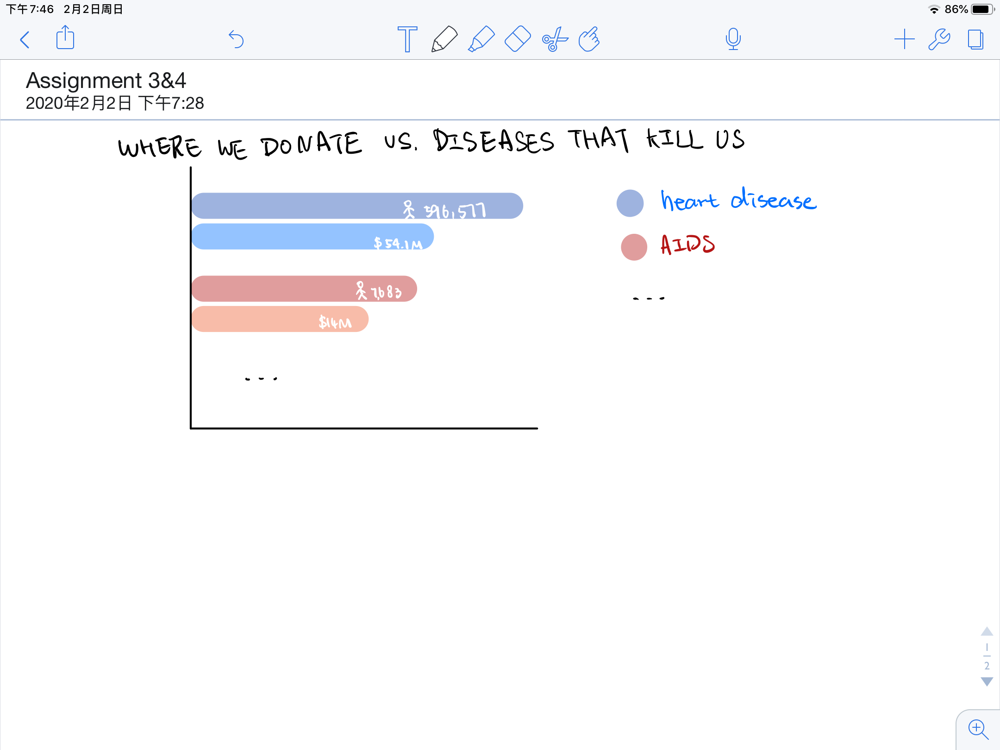
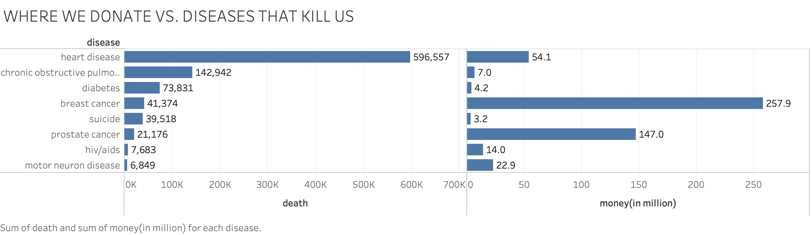

# Assignment 3&4:
## Link to original data visualization
[WHERE WE DONATE VS. DISEASES THAT KILL US](https://www.vox.com/2014/8/20/6040435/als-ice-bucket-challenge-and-why-we-give-to-charity-donate)

I select this data visualization is because I am interested in charity donation. The chart talks about the relationship among donation and number of death of the disease. It is an interesting topic to discover, also the chart uses a special way to represent the data.

## Wireframe a solution
After discovering the problem of the original data visualization: the comparison of the left chart and the right chart is not in pairs, the donate money circle in the left does not match the death number circle in the right, which could easily make the audience confused. And the size of circle is not a correct parameter of the number, the comparison among the circle areas cannot represent the true relationship among numbers.

I decided to use bar chart to represent the data. I want to make each disease be a pair and choose a color for each pair. And represent in descending order to make it clear for the audience to see the trend.

## Test the solution
I asked my friends to measure my wireframe using Stephen Few's method. They think it is good except the chart is still to colorful and might not be very friendly to color blindness group. So I decide to make two charts (in comparison) to complete the visualization.

## My final solution

In this case, I choose to use two charts to finish the visualization. The left bar chart represents the number of death of each disease, and the right chart represents the money donated in million. I show the death number in a descending order to help the audience see the trend more straight forward. Also, with two charts in pairs, I could avoid using color to differentiate each disease group, and in this way, the visualization could be more friendly to color blindness people.
