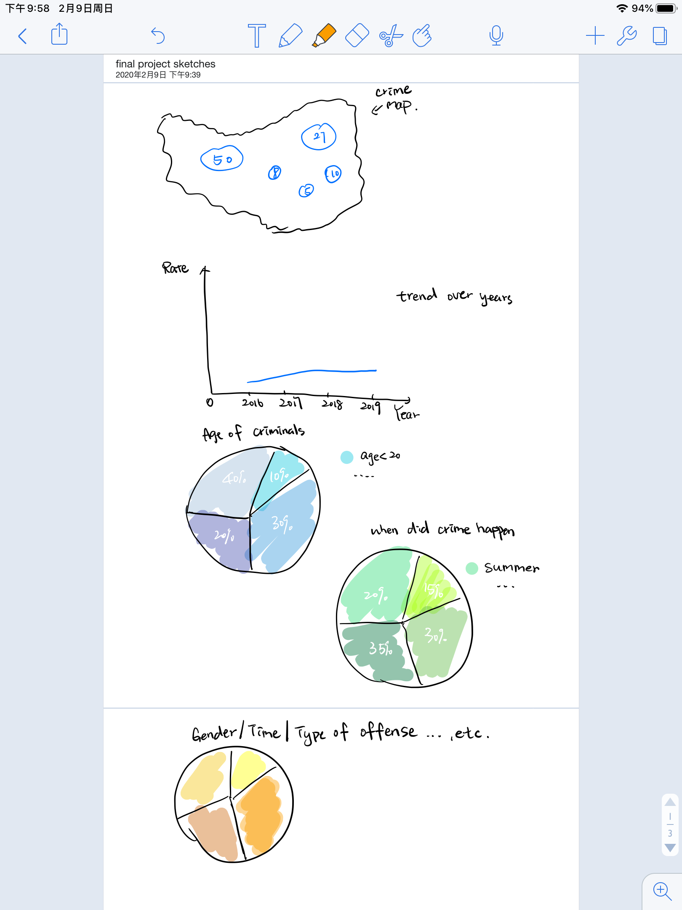

# Outline of final project

## Summary
This final project is going to focus on the topic of crime rate of Pittsburgh and discussing related factors like: Type of Offense, Age, Gender, Date, Season, Time, Incident Zip codes and Weapon type, etc. related to crime.

## Core Elements
First, there is going to be map of crime, showing some major zones of crime accidents. Then there might be a line chart analyzing the trend of crime rate. After that, I may use pie chart to analyze the some core parameters like Type of Offense, Age, Gender, Date, Season, Time, Incident Zip that may affect crime willingness and draw a conclusion. 

# Initial sketches

# The data

I will get data from two sources below:

[Pittsburgh Arrest Data] (https://data.wprdc.org/dataset/arrest-data)

[Pittsburgh Firearm Seizure] (https://data.wprdc.org/dataset/pbp-fire-arm-seizures)

I plan to analyze available Pittsburgh arrest data for 2016-2019, and weapon ownership data in order to discover trends, identify association between factors, discover clusters or segments and provide the audience with relevant recommendations.

# Method and medium

My current plan is to use Shorthand for the final project presentation. And I may also use Tableau for the map and pie chart, to further analyze the correlation between factors. If needed, I may use some coding language to clean the data and do some extreme value correction first, and then import the cleaned data to the platform mentioned above for further analysis. 
