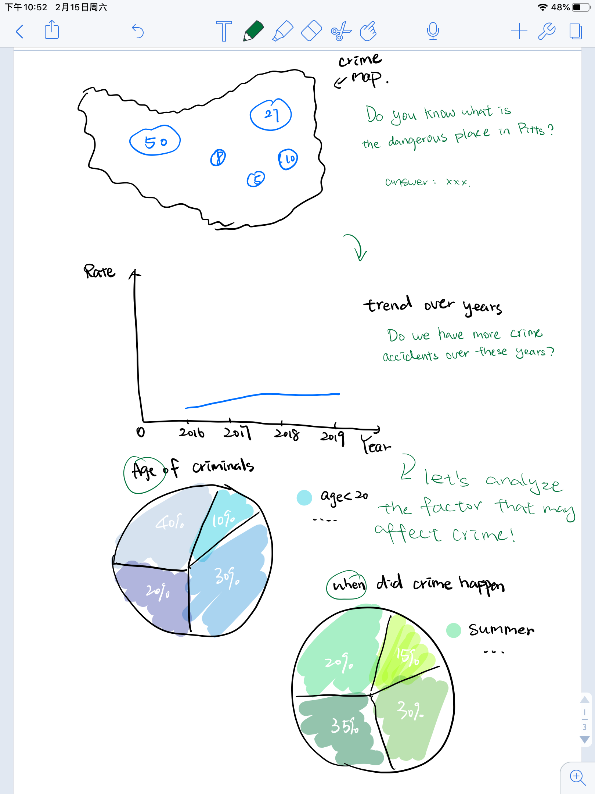
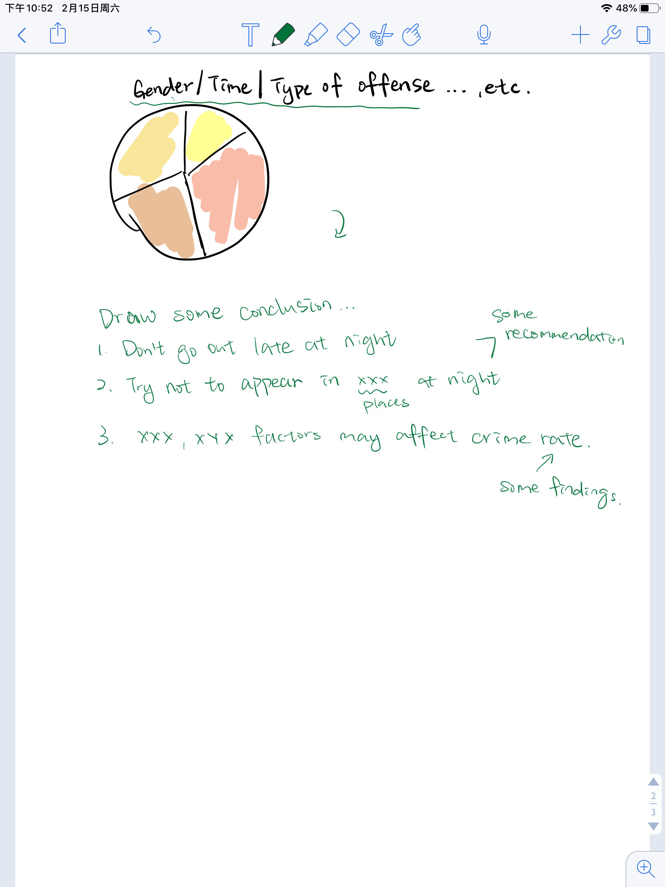
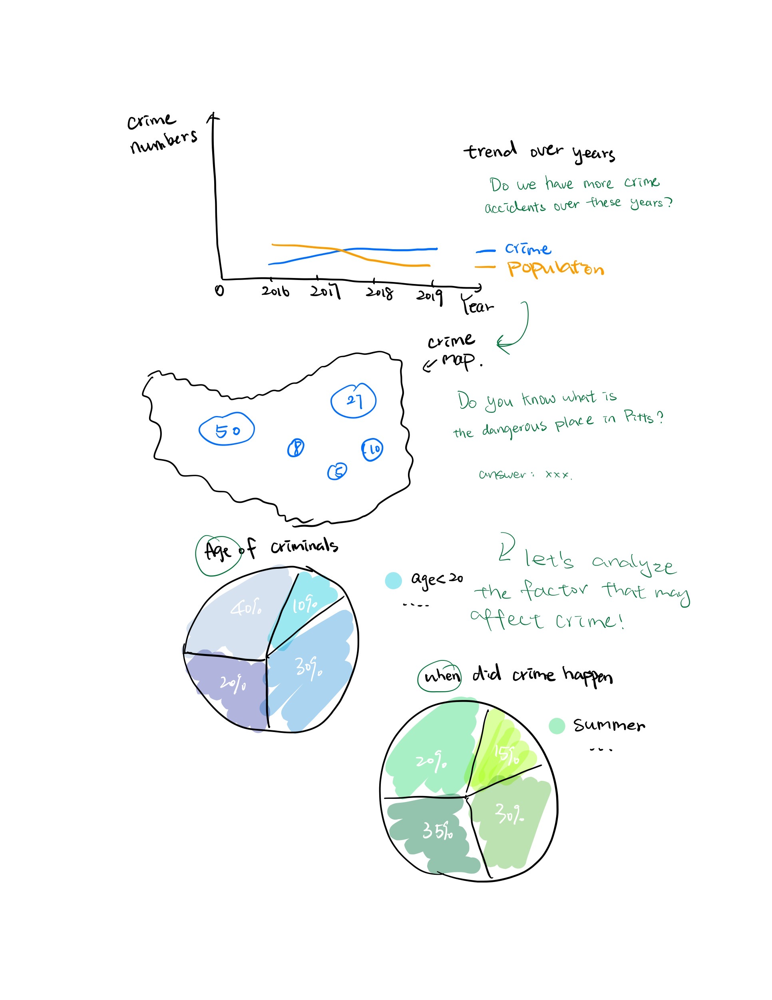
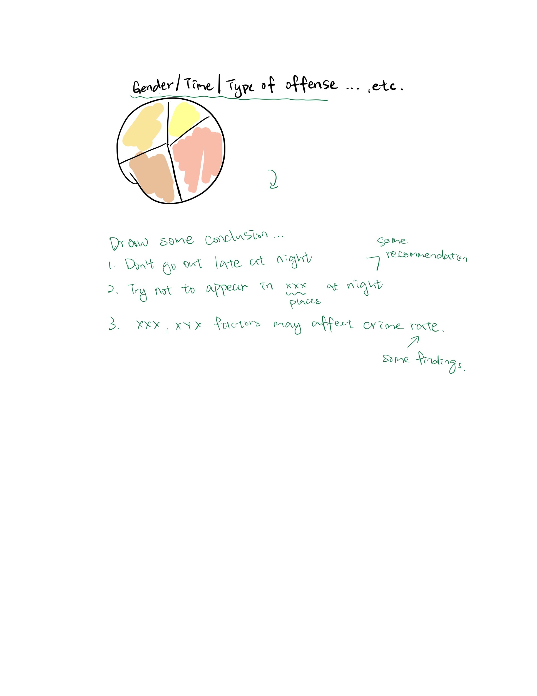

# Wirefames / storyboard for user feedback

Below is the original sketches:

# Interviews

## target audience
My target audience is CMU students living in Pittsburgh. I believe they would be interested in the fun facts of crime happened in their community and I hope to provide them some suggestion to avoid being attacked by criminals.

## identify representative
I randomly picked three CMU students from different living area in Pittsburgh. 

## interview questions
I asked them questions like:
1. do you think it is a fluent presentation? 
2. is it logical? 
3. from the content perspective, what do you think needed to be added or deleted? 

## suggestions
My friends think there are three places I need to change:
1. There are some factors do not neet to be mentioned like defense type. Cause when a student met a criminal, all he/she should do is run, hide and call the police
2. I should put the trend chart at the top to make the whole presentation more fluent, leaving the crime map and other pie chart together
3. To make the result more reliable and meaningful to the true fact, I should add a population change of Pittsburgh on the trend chart. 

# Revised wireframes

